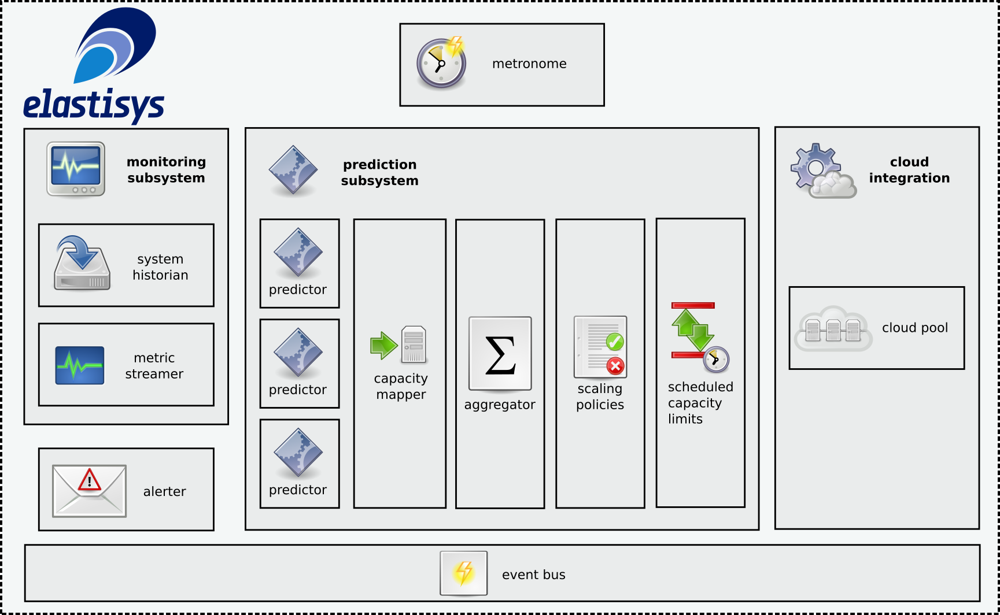
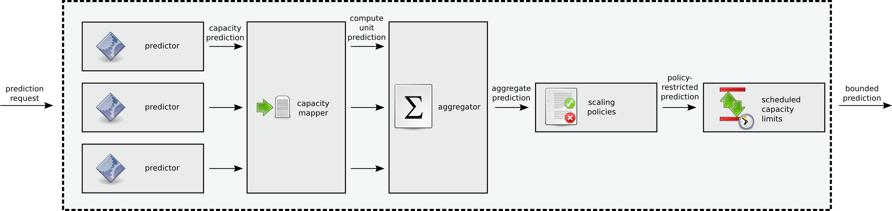

# The autoscaler server

An [elastisys:scale](http://elastisys.com) auto-scaling system consists of two
main parts: (1) an elastisys:scale autoscaler server and (2) a cloud pool.

The autoscaler server hosts a number of autoscaler *instances*. Each autoscaler
instance collects monitoring data reported by an application service from a
monitoring database and applies scaling algorithms to, ultimately, emit a number
of required machine instances to keep the auto-scaling-enabled service running
smoothly. This number is communicated over a secured TLS channel to the cloud
pool, which instructs the cloud infrastructure to add or remove VMs, as
appropriate. A cloud pool needs to implement a simple REST API as described
[here](http://cloudpoolrestapi.readthedocs.org/en/latest/).

A number of cloudpools supporting different cloud providers are published in our
[scale.cloudpool Github
repository](https://github.com/elastisys/scale.cloudpool).

A schematical overview of the system is shown in the image below.


The autoscaler server publishes a REST API that can be used to instantiate and
manage autoscaler instances.

For instructions on how to build, refer to the `Building` section below.


## Creating an autoscaler instance
An autoscaler instance is composed of a number of *subsystems*, each solving a
single, well-defined task within the autoscaler. The subsystems come in two
flavors: *core subsytems* and *add-on subsystems*.

### Core subsystems
*Core subsystems* are required for the autoscaler to function. Each of the core
subsystems are plug-able: standard implementations exist but can be replaced by
other implementations. Although the standard implementations should cover most
needs, replacing a core subsystem could be warranted, for instance if we need to
make special kinds of predictions, involving math or steps that aren't supported
by the standard prediction subsystem, we can easily replace the prediction
subsystem with our custom implementation.  The core subsystems, depicted in the
image below, and their standard implementations are as follows:



   - *Metronome*: drives the execution of the autoscaler. It is responsible for
     periodically carrying out resize iterations during which the autoscaler
     predicts the machine need near-time future and sets the new desired size on
     the cloudpool endpoint accordingly.
   - *Monitoring subsystem*: is configured with a *metric streamer* and a
     *system historian*. The metric streamer continuously collects metric values
     from a metric store (such as [OpenTSDB](http://opentsdb.net/)) and streams
     those values to the predictors in the prediction subsystem (see below). The
     system historian captures monitoring and performance data from the
     autoscaler itself and writes those metrics to a (configurable) metric
     store. Such data can be used to track system operation over time, detect
     operational trends or just keep a historical account of system actions for
     future reference.
   - *Prediction subsystem*: predicts the machine pool size needed to
     accommodate (projected) future load on the service by running a collection
     of *predictors* (scaling algorithms) to estimate future machine need based
     on collected load metrics.
   - *Cloudpool proxy*: a local proxy that the autoscaler uses to send commands
     to a remote cloudpool endpoint, over the [cloudpool REST
     API](http://cloudpoolrestapi.readthedocs.org/en/latest/), which takes care
     of resizing the machine pool according to protocols/APIs of the cloud
     hosting the machines. The cloudpool API shields the autoscaler from the
     details of the particular cloud we are running in.
   - *Alerter*: notifies the outside world about interesting events that are
     raised on the autoscaler's event bus. Different Alerter implementations may
     support different protocols (for example, SMTP or HTTP) to, for instance,
     send system alerts to human administrators or to external webhooks.

The particular subsystem implementations that make up an autoscaler instance are
specified in a "blueprint" JSON file.

If we only want to use the standard implementations of all subsystems (i.e. a
Metronome that uses current time, rather than some simulation time; a default
monitoring subsystem and prediction subsystem; a cloud pool proxy that connects
to a remote [cloudpool
endpoint](http://cloudpoolrestapi.readthedocs.org/en/latest/); and an Alerter
that can send notifications using SMTP for email and make POSTs to HTTP(S)
webhooks), which is usually the case, the blueprint for an instance is simply:

```javascript
{
   id: "my-autoscaler"
}
```

If we want to specify the concrete implementation classes for every subsystem,
this can be done too -- either by specifying fully qualified Java class names
for subsystem implementations or by using aliases (if available) as below:

```javascript
{
  "id": "my-autoscaler",
  "metronome": "StandardMetronome",
  "monitoringSubsystem": "StandardMonitoringSubsystem",
  "predictionSubsystem": "StandardPredictionSubsystem",
  "alerter": "StandardAlerter",
  "cloudPool": "StandardCloudPoolProxy"
}
```

The blueprint can be sent to the autoscaler server over its REST API.  For
example, using `curl`:

```bash
curl -v --insecure -X POST \
     -d @blueprint.json  --header "Content-Type:application/json" \
      https://localhost:8443/autoscaler/instances
```


### Add-on subsystems
As already mentioned, the autoscaler also supports *add-on subsystems*.  These
are subsystems that are not strictly necessary for the autoscaler to operate,
but may extend it with additional functionality. High availability is an example
of functionality that such add-on subsystems could contribute. Add-on subsystems
are configured on the autoscaler factory (server) level, and are included in all
created autoscaler instances.

In the standard autoscaler server distro, add-on subsystems are given with the
`--addons-config` flag which refers to a JSON file A JSON file containing a map
of add-on subsystems, which will be added to each created autoscaler
instance. Keys are names (such as `haSubsystem`) and values are class names. An
example addons-config that adds an HA subsystem to each created autoscaler
instance is

```javascript
{
    "haSubsystem": "com.my.autoscaler.addon.QuorumScaler"
}
```


## Configuring an autoscaler instance
Once an autoscaler instance has been instantiated by creating it from a
blueprint, it needs to be configured. This is done through a configuration JSON
document. The configuration document provides configurations for every
autoscaler subsystem (both core and add-ons).

For an example of a configuration, refer to the samples under
[/core/src/test/resources/autoscaler](/core/src/test/resources/autoscaler).

The configuration file can be sent to the autoscaler server over its REST API.
For example, using `curl`:


```bash
curl -v --insecure -X POST \
     -d @config.json  --header "Content-Type:application/json" \
     https://localhost:8443/autoscaler/instances/my-autoscaler/config
```


## Starting an autoscaler instance
The autoscaler instance is now created and configured but it is still in a
stopped state. To active it -- making it fetch metric values, carry out
predictions and adjust the cloudpool -- it needs to be started.

This can also be done by a call to the autoscaler server's REST API:

```bash
curl -v --insecure -X POST https://localhost:8443/autoscaler/instances/my-autoscaler/start
```


*Note: before starting an new autoscaler instance, one should make sure that the
targeted cloud pool is up and running at the expected address (until it is, the
autoscaler will keep sending error alerts on failed connection attempts).*


## Exercising the autoscaler's REST API
A list `curl` commands that exercise the autoscaler server's REST API is shown
below.

- List instances:

```bash
curl -v --insecure -X GET https://localhost:8443/autoscaler/instances
```


- Create an autoscaler instance:

```bash
curl -v --insecure -X POST \
     -d @blueprint.json  --header "Content-Type:application/json" \
     https://localhost:8443/autoscaler/instances
```


- Retrieve the autoscaler blueprint:

```bash
curl -v --insecure -X GET \
     https://localhost:8443/autoscaler/instances/<id>/blueprint
```

- Configure an autoscaler instance:

```bash
curl -v --insecure -X POST \
     -d @config.json  --header "Content-Type:application/json" \
     https://localhost:8443/autoscaler/instances/<id>/config
```

- Retrieve the autoscaler's universally unique ID (assigned at the time of creation):

```bash
curl -v --insecure -X GET \
     https://localhost:8443/autoscaler/instances/<id>/uuid
```

- Retrieve the autoscaler configuration:

```bash
curl -v --insecure -X GET \
     https://localhost:8443/autoscaler/instances/<id>/config
```

- Retrieve autoscaler instance state:

```bash
curl -v --insecure -X GET \
     https://localhost:8443/autoscaler/instances/<id>/status
```

- Start the autoscaler instance:

```bash
curl -v --insecure -X POST \
     https://localhost:8443/autoscaler/instances/<id>/start
```

- Stop the autoscaler instance:

```bash
curl -v --insecure -X POST \
      https://localhost:8443/autoscaler/instances/<id>/stop

```


## A brief overview of the prediction pipeline
The standard prediction subsystem implementation used by the autoscaler is
depicted in the image below:



The prediction subsystem is asked at regular intervals (by the metronome) to
make a prediction regarding the appropriate size of the cloud pool for an
appropriately long time in the future.  Appropriately long in this case means
that the cloud service should have time to make newly allocated resources fully
operational in time for predicted usage increases.

The steps taken to produce a pool size prediction are as follows:

- A Prediction Request comes to the subsystem.
- The subsystem requests a prediction from each Predictor.
- Each Predictor, which has continuously been fed a stream of metric data,
  performs whatever analytics it needs, and emits a Capacity Prediction, i.e. a
  prediction in terms of the metric that it is watching. So if a predictor
  attempts to establish trends in number of logged in users, it will emit a
  prediction in terms of just that.
- The Capacity Mapper will receive a Capacity Prediction in terms of monitored
  metrics from each Predictor. These may be seemingly unrelated to each other
  (e.g. number of logged in users vs. number of anonymous users) and need to be
  mapped to something more concrete, i.e. cloud VM instances. The Capacity
  Mapper does just that for each prediction, and emits Compute Unit Predictions
  instead.
- The Aggregator aggregates Compute Unit Predictions using some mathematical
  formula, e.g.  by taking the max of each its inputs, or by considering the
  prediction source and applying weights to the predictions in accordance with
  how much trust one has in each predictor.  For instance, if one predictor is
  configured to be very conservative, looking only to current usage, and one
  more "visionary" in that it attempts to predict the future long-term, perhaps
  one might want to trust the conservative more, but still be influenced by the
  other one. The Aggregator provides this functionality and emits an Aggregate
  Prediction.
- The single Aggregate Prediction is fed into the Scaling Policies component,
  which ensures that the suggested new value adheres to configured
  policies. This may be considered the "common sense" component, in that it
  ensures e.g. that we never try to scale down while we are currently scaling
  up, even though some predictions say so. From the Scaling Policies component
  comes a Policy-Restricted Prediction.
- The Policy-Restricted Prediction is passed to the Scheduled Capacity Limits
  component, which ensures that the prediction that will ultimately be emitted
  from the prediction subsystem is within the bounds defined by the system
  administrator. The Scheduled Capacity Limits component is configured to,
  e.g. only allow the service to get between 1 and 10 VM instances (1 to ensure
  that we never shut the whole service down, and 10 to avoid high deployment
  costs). If a prediction asks for 12 instances, it will be limited to the 10
  that the capacity limits dictate. However, an Alert will be created that can
  help a systems administrator adjust the upper limit in the future.

Once a prediction has made it through that entire chain of components, it is fed
into the cloud pool to affect the resizing of the cloud service.


## Building
The source can be built as follows.

- First build the latest version of `scale.commons` and `scale.cloudpool`,
  especially if the autoscaler depends on the latest `SNAPSHOT` of any of them.

        git clone https://github.com/elastisys/scale.commons.git
        git clone https://github.com/elastisys/scale.cloudpool.git
        cd scale.commons && mvn clean install
        cd scale.cloudpool && mvn clean install

- Then build the autoscaler:

        cd scale.autoscaler
        mvn clean install

- The `distro` module of the build produces an executable all-in-one `.jar`. The
  jar file runs a web server that serves up the autoscaler REST API, through
  which autoscaler instances can be created and managed. The `.jar` file is
  found under the `target` directory of each distribution and can be run as
  follows:

        java -jar <distro-name>-<version>.jar

  You may need to set some flags, use the `--help` to see the available
  options. Once the server is up and running, use the REST API (as described
  above) to manage it.

- Each distribution under `distro` also builds a Docker image, as described
  below.


### Building docker images
A `Dockerfile` is included in each distribution under the `distro` module. It
can be used to generate a docker image for the particular autoscaler server
rendering that the distribution produces. Each distribution's build file also
contains a build goal that can be used to produce the image, once the project
binary has been built in the `target` directory (for example, via `mvn
package`). To build the image simply run:

    mvn exec:exec -Dexec.executable=docker

To specify a different version for the image tag than the default (the version
specified in the `pom.xml`), pass a `-Ddocker.image.version=<version>` option
with the desired version name.

For details on how to execute a container from the image, refer to the
`README.md` of the particular distribution module.


## Simulations
A simulation framework, useful for exercising the autoscaler and its prediction
algorithms against different workloads, is found under [simulation](simulation).
